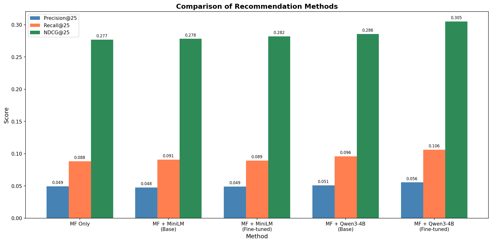

  
  
  
  

---

  <strong>Master 2 — Machine Learning for Data Science</strong> 
  <strong>Project: Hybrid Movie Recommendation System (MF + LLM Embeddings)</strong>

---

## Project Information  

| **Category**        | **Details**                                                                                   |
|---------------------|-----------------------------------------------------------------------------------------------|
| **University**      | University Paris Cité                                                                         |
| **Master Program**  | Machine Learning for Data Science (MLSD/AMSD)                                                 |
| **Project Type**    | Hybrid Recommender System (Collaborative Filtering + LLM-based Content Filtering)             |
| **Supervision**     | Aghiles Salah                                                                                 |
| **Students**        | Bastien HOTTELET, Hamady GACKOU                                                               |
| **Dataset**         | MovieLens — ml-latest-small                                                                   |
| **Objective**       | Develop and evaluate a hybrid movie recommender combining PMF and LLM embeddings (MiniLM, Qwen3-4B) |
| **Academic Year**   | 2025/2026                                                                                     |

---

This project explores a hybrid recommendation approach combining **Collaborative Filtering** (Probabilistic Matrix Factorization) with **Content-Based Filtering** using semantic embeddings from Large Language Models (MiniLM and Qwen).

The system is evaluated on the MovieLens (ml-latest-small) dataset, comparing lightweight embedding models against large parameter models (4B) with and without fine-tuning.

##  Results

The following chart compares the Precision, Recall, and NDCG at k=25 across all implemented methods.

**Key Findings:**
* **Hybrid > Pure CF:** Hybrid methods generally outperform standalone Matrix Factorization, particularly in Recall.
* **Model Size Matters:** The larger `Qwen3-Embedding-4B` model significantly outperforms the smaller `MiniLM`, capturing better semantic nuance in movie metadata (titles, genres, tags).
* **Effect of Fine-tuning:** Fine-tuning the embeddings on user interaction pairs (LoRA for Qwen) provided the highest performance metrics (Precision@25: 0.055, Recall@25: 0.106).

##  Methodology

The notebook implements five distinct strategies:

1. **MF Only:** Pure Probabilistic Matrix Factorization (PMF) using the `cornac` library.
2. **MF + MiniLM (Base):** Hybrid score combining MF latent factors with cosine similarity from pre-trained `all-MiniLM-L6-v2` embeddings.
3. **MF + MiniLM (Fine-tuned):** Same as above, but the model is fine-tuned using Contrastive Loss on positive user-item pairs.
4. **MF + Qwen3-4B (Base):** Hybrid score utilizing `Qwen/Qwen3-Embedding-4B` (fp16).
5. **MF + Qwen3-4B (Fine-tuned):** Qwen model fine-tuned using **LoRA (Low-Rank Adaptation)** and 4-bit quantization (`bitsandbytes`) to manage memory constraints.

### Hybrid Scoring Logic

The final recommendation score is calculated as a weighted sum:

$$Score = \alpha \cdot Score_{MF} + (1 - \alpha) \cdot Score_{Content}$$

*Where $\alpha$ is tuned to 0.85.*

##  Setup & Usage

**Prerequisites:**
* Python 3.8+
* GPU with at least 12GB VRAM (required for Qwen 4B LoRA training).
